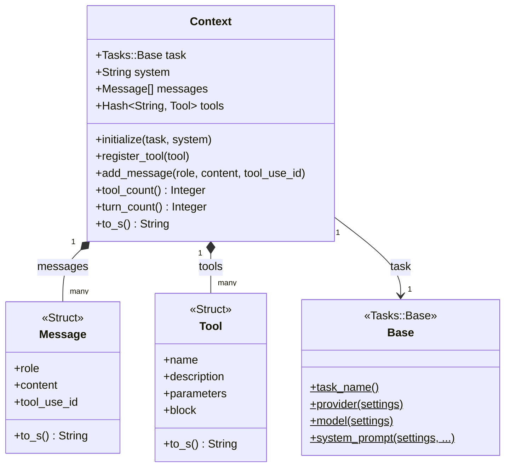

```mermaid
classDiagram
    class Context {
        +Tasks::Base task
        +String system
        +Message[] messages
        +Hash~String, Tool~ tools
        +initialize(task, system)
        +register_tool(tool)
        +add_message(role, content, tool_use_id)
        +tool_count() Integer
        +turn_count() Integer
        +to_s() String
    }

    class Message {
        <<Struct>>
        +role
        +content
        +tool_use_id
        +to_s() String
    }

    class Tool {
        <<Struct>>
        +name
        +description
        +parameters
        +block
        +to_s() String
    }

    class Base {
        <<Tasks::Base>>
        +task_name()$
        +provider(settings)$
        +model(settings)$
        +system_prompt(settings, ...)$
    }

    Context "1" *-- "many" Message : messages
    Context "1" *-- "many" Tool : tools
    Context "1" --> "1" Base : task
```
